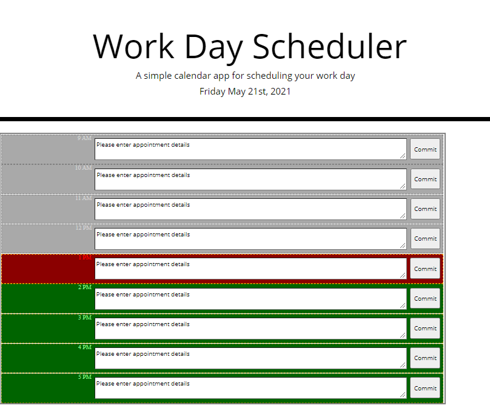
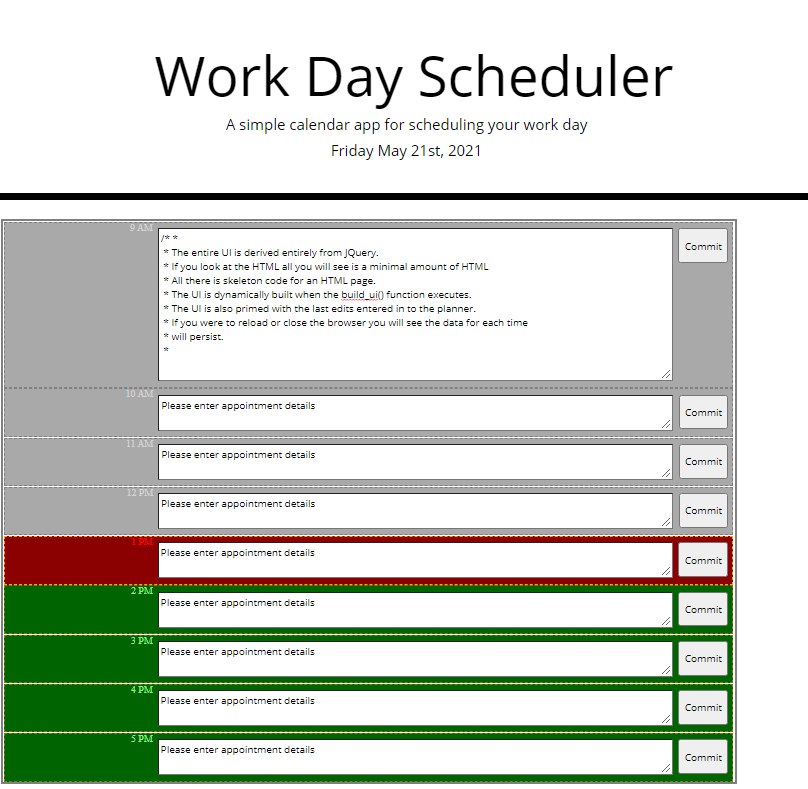
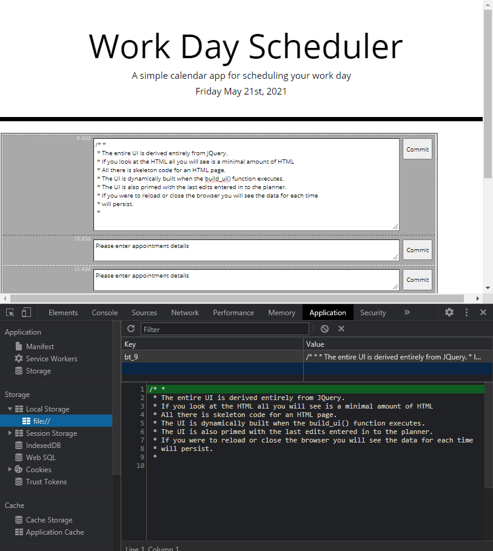
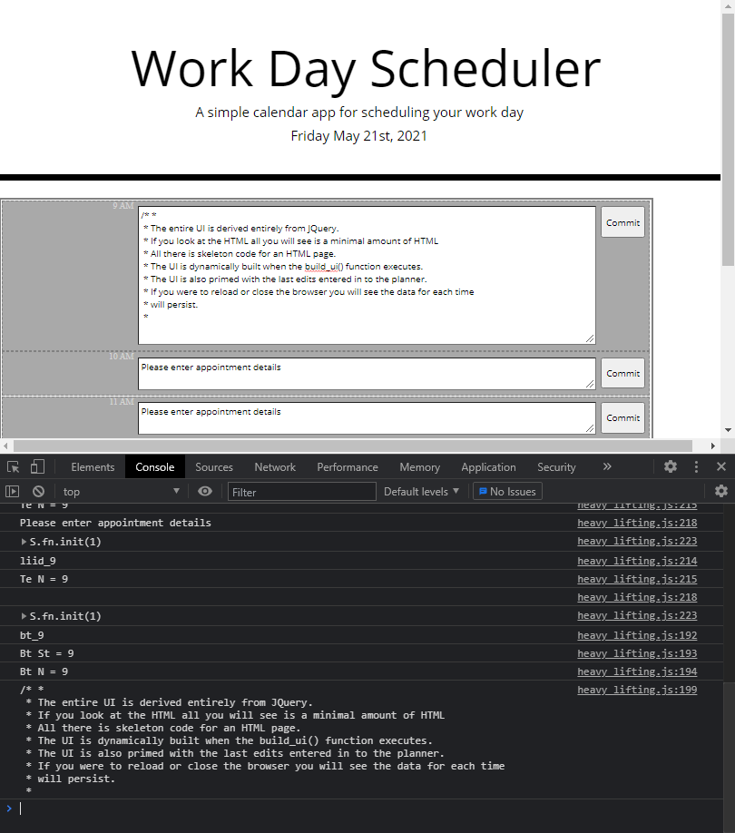
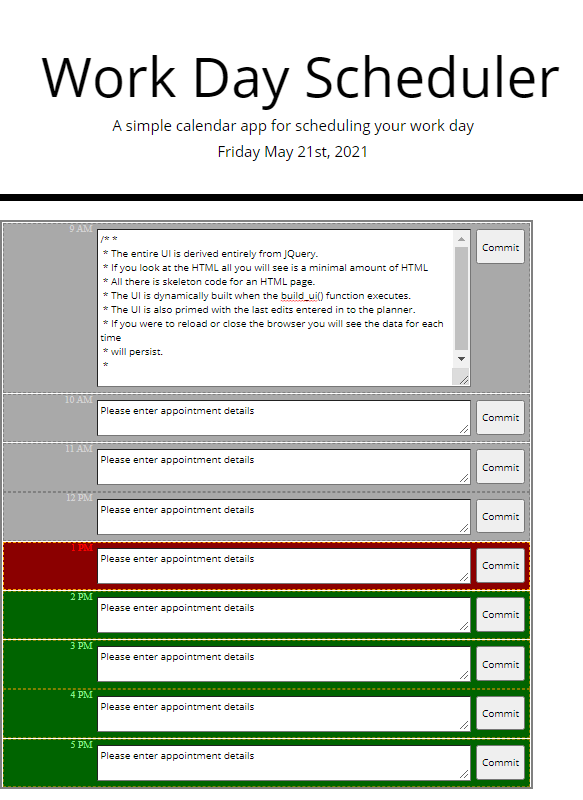

# jQuery UI and The One Day Planner


* Link access to the "The One Day Scheduler" [Published Link](https://xtended99.github.io/The-One-Day-Scheduler).
* Link access to the project page for "The One Day Scheduler" [Repository Link](https://github.com/Xtended99/The-One-Day-Scheduler).


## Your Task

```
Create a simple calendar application that allows a user to save events 
for each hour of the day by modifying starter code. This app will run 
in the browser and feature dynamically updated HTML and CSS powered by 
jQuery.
```

## User Story

```
As An employee with a busy schedule. I Want to add important events to a
daily planner so that I can manage my time effectively
```

## Acceptance Criteria

```
Given: I am using a daily planner to create a schedule

When:  I open the planner,
Then:   the current day is displayed at the top of the calendar
When:  I scroll down,
When:  I am presented with timeblocks for standard business hours
When:  I view the timeblocks for that day,
Then:   each timeblock is color coded to indicate whether it is in 
        the past, present, or future.
When:  I click into a timeblock.
Then:  I can enter an event.
When:  I click the save button for that timeblock.
Then:   the text for that event is saved in local storage.
When:  I refresh the page.
Then:   the saved events persist.
```

### Program Details

```
_______________________________________________________________________

Premise:

 * The entire UI is derived entirely from JQuery.
 * If you look at the HTML all you will see is a minimal amount of HTML
 * All there is skeleton code for an HTML page.
 * The UI is dynamically built when the build_ui() function executes.

 The UI is also primed with the last edits entered in to the planner.
 * If you were to reload or close the browser you will see the data for each time
 * will persist.


Features included:

 *   Tab order - Tab order will take you from text field to button in succession
 *     throughout each time slot.

 *   Initial verbage is present so that you know if data has not been entered for 
 *     time slot.

 *   Time slots are differentiated by color code to represent paat, present and future states.
 *   Green - represents future dates from the present time the calendar is viewed.
 *   Red - is the present hour
 *   Grey - is / are time slots that have elapsed from the present time in Red.

 *   The text field is expandable and contains scroll bars

 *   Text fields will only blank the filed if the non standard messgage
 *     "Please enter appointment details" is not visible.

 *   The date is shown at the top of each page

 *   The hour the time slot belongs to is clearly marked on the very left hand side
 *
 *   The UI will shrink to accommodate smaller screen sizes

 *   Console messages have been left in place to demonstrate how the application
 *     works at different stages.

 *   And you verify the storage persistence when you open the application tab under
 *    developer tools

 *   Text fields and the text will denote potential change is possible 

 *   Buttons will denote a change in appearance when hovered over to show visual awareness.

Program operation:

 *   Basically all you have to do is click on the time slot desired 
 *   Enter the text as you wish an to commit the text just press the commit but on the right,

TODOS:

 *   Move forward and backwards by day, month or year
 *   Roll back to the prior text if the user would want to revert the previous
 *   information for a time slot or day.


Please:
 *   View the index.html, main.css and heavy_lifting.js for code details.

Thank You
     Angel Sosa
Enjoy!!!
 _______________________________________________________________________
```

<span style="color:blue">**Application Images:**</span>

Using the application for the first time   
      
     
Modifiyng A field with an expanded text area
     
     
Showing Developer Tools Ouptut for debbuging and validation purposes   
     
   
Showing console view
     
   
Compacct View   
     
  
